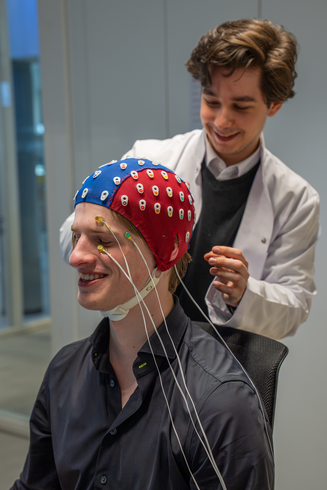
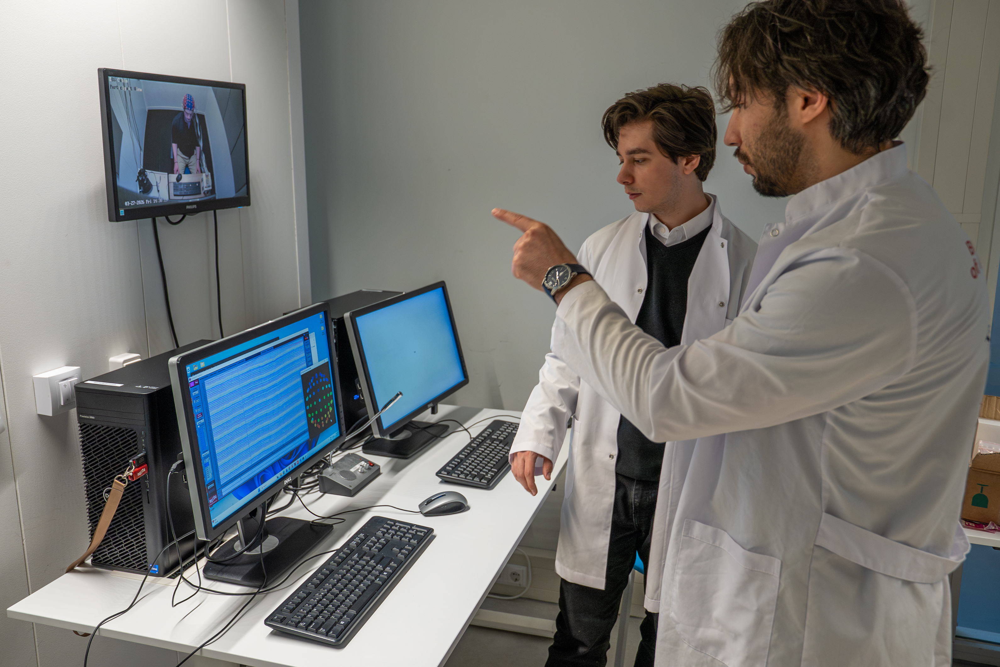

# EEG Studies Inside the Lab

Our Experience Lab features an Electroencephalography (EEG) device, which measures people's brain activity in reaction to photos, videos, or websites.

While sitting comfortably in our lab, participants wear an elastic swim cap with electrodes registering their brain activity. These signals are amplified and recorded on a computer. When the signals are averaged over 30 or so participants, clear patterns emerge which reveal emotional reactions to different materials — such as marketing content or museum exhibits.

---

  <figure style="flex: 1; text-align: center; margin: 0;">
    
    <figcaption style="font-style: italic; color: #666; margin-top: 8px; font-size: 0.9em;">
      Lab assistant Ionut Botoroga preparing a participant for data collection.
    </figcaption>
  </figure>

  <figure style="flex: 1; text-align: center; margin: 0;">
    
    <figcaption style="font-style: italic; color: #666; margin-top: 8px; font-size: 0.9em;">
      Dr. Sait Durgun and lab assistant Ionut Botoroga monitoring the experiment.
    </figcaption>
  </figure>

We can also simulate experiences in virtual reality, and measure when during a live or virtual experience people become more emotional. EEG is extremely precise in time — we can detect if a person is emotional even before they are aware of it.

---

## Spotlight: Wim Strijbosch

Wim Strijbosch is one of the researchers in the lab actively working with EEG.

> "In my PhD, I aim at identifying how the temporal dynamics of emotions in an experience relate to how experiences are remembered and evaluated. I have studied these processes in the context of a virtual reality film and watching artworks using EEG, and in the context of a musical theatre show using skin conductance."

---

## Example Project: Van Gogh Storysperience

Participants were shown two videos about Vincent van Gogh intended for museum display. One presented information factually and in a neutral tone. The other presented the same information as a story designed to evoke emotions. The emotional experience of both videos was measured with EEG in the Experience Lab.

Studies like these help understand when people are more emotionally engaged in a museum experience. The more emotionally engaged, the better people remember an experience — which is valuable for word-of-mouth advertising, among other things.
