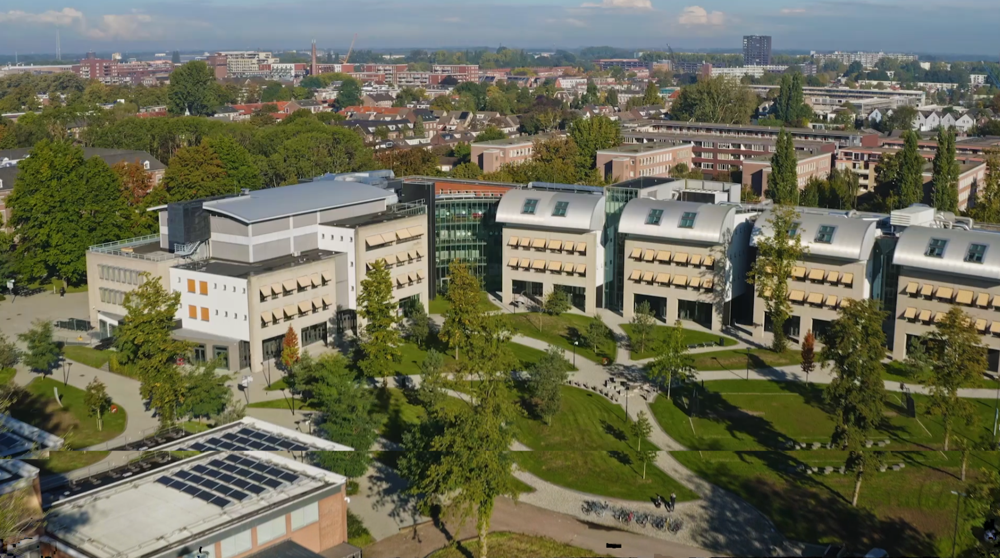

# Welcome to the Experience Lab

**Understanding the emotions behind an experience**

The Experience Lab is a state-of-the-art experience design, management and measurement facility at Breda University of Applied Sciences. We measure emotions directly from the body and the brain.

People experience life every day from the moment they wake up until the moment they go to bed. They are guided by their emotions — and are even willing to pay for the way experiences make them feel. This means that emotions drive the value of leisure, tourism, hospitality, and entertainment experiences. Understanding and measuring emotions is thus important to create the best possible experience.

Our research is driven by the interests of our institute and our students — in the form of thesis and course assignments — or commissioned by industry partners at commercial rates.

---

## What we do

Most of our projects contribute to solving persistent industry issues such as:

- Service quality
- Physical environment design
- Staff training
- Crowding

Over time, we hope our insights will contribute to better quality experiences for everyone, eventually improving quality of life in general.

---

  
  

    <blockquote>
      
<em>"Emotions drive the value of leisure, tourism, hospitality, and entertainment experiences"</em>

    </blockquote>
    
<strong>Prof. Dr. Marcel Bastiaansen</strong> Head of the Experience Lab

  

---

## Contact

  

    
<strong>Email:</strong> <a href="mailto:experiencelab@buas.nl">experiencelab@buas.nl</a>

    
<strong>Phone:</strong> +31 76 533 22 03

    
<strong>Address:</strong> Mgr. Hopmansstraat 2 | Frontier Building | 4817 JS Breda | The Netherlands

  

  

